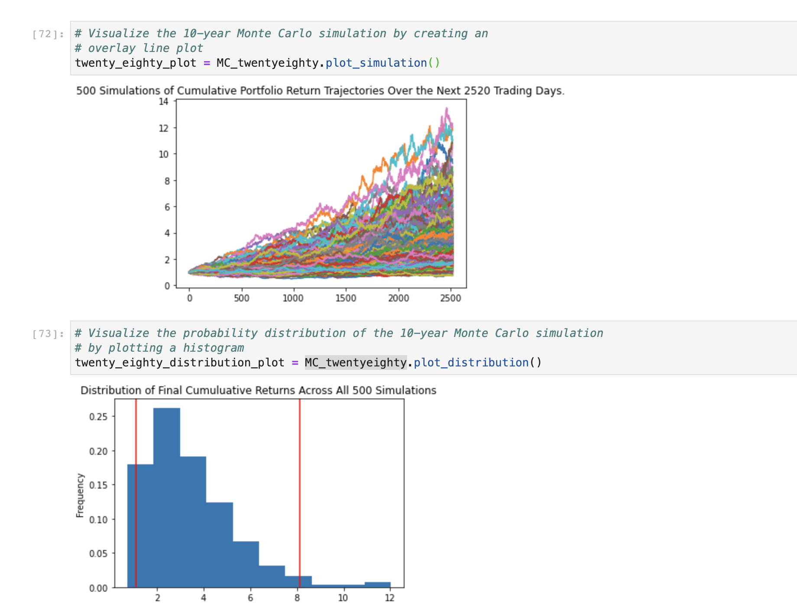

# Module_5_Challenge
This is the repository for my module 5 challenge. This module challenge consisted of two steps, creating a financial planner for emergencies and creating a financial planner for retirement.

### Step 1
In this step, creating a financial planner for emergencies, we pulled stock and bond info from the Alpaca API, and we pulled crypto info from the Free Crypto APi in order to build a financial planner for emergencies. We then combined the data from the two to get a better idea of how much money we have.

### Step 2
In the next step, we ran a Monte Carlo Simulation on 10 years of historical data (for the same stock/bonds that we used in step 1) to predict how long it might take for an individual to retire based on different investment decisions.

---

## Technologies

Import the following at the beginning of your jupyter notebook:

```python
import os
import requests
import json
import pandas as pd
from dotenv import load_dotenv
import alpaca_trade_api as tradeapi
from MCForecastTools import MCSimulation

%matplotlib inline
```

---

## Example

This image shows the Monte Carlo Simulation over 10 years for a split of 20% to AGG and 80% to SPY. The first plot shows all the possible results in a plot, and the next plot shows the distribution of those results.



---

## Contributors

UCB Fintech Bootcamp, Wynham Guillemot 

---

## License

MIT License

Copyright (c) [2021] [UCB Fintech Bootcamp, Wyham Guillemot]

Permission is hereby granted, free of charge, to any person obtaining a copy
of this software and associated documentation files (the "Software"), to deal
in the Software without restriction, including without limitation the rights
to use, copy, modify, merge, publish, distribute, sublicense, and/or sell
copies of the Software, and to permit persons to whom the Software is
furnished to do so, subject to the following conditions:

The above copyright notice and this permission notice shall be included in all
copies or substantial portions of the Software.

THE SOFTWARE IS PROVIDED "AS IS", WITHOUT WARRANTY OF ANY KIND, EXPRESS OR
IMPLIED, INCLUDING BUT NOT LIMITED TO THE WARRANTIES OF MERCHANTABILITY,
FITNESS FOR A PARTICULAR PURPOSE AND NONINFRINGEMENT. IN NO EVENT SHALL THE
AUTHORS OR COPYRIGHT HOLDERS BE LIABLE FOR ANY CLAIM, DAMAGES OR OTHER
LIABILITY, WHETHER IN AN ACTION OF CONTRACT, TORT OR OTHERWISE, ARISING FROM,
OUT OF OR IN CONNECTION WITH THE SOFTWARE OR THE USE OR OTHER DEALINGS IN THE
SOFTWARE.
